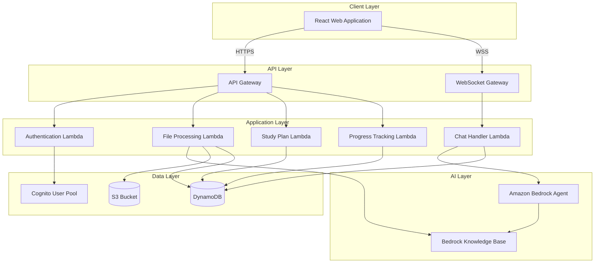

# Design Document: Study Plan Assistant

## Overview

The Study Plan Assistant is a full-stack web application that combines AI-powered conversational interfaces with intelligent study plan generation to help college students learn more effectively. The system leverages Amazon Bedrock agents to provide Socratic-style tutoring while analyzing course materials and student availability to create personalized, adaptive study schedules.

### Key Design Principles

1. **AI-First Interaction**: The Bedrock agent serves as the primary interface for student engagement, using Socratic questioning to deepen understanding
2. **Adaptive Learning**: The system continuously adjusts study plans based on student progress and demonstrated mastery
3. **Context-Aware Planning**: Study plans are generated considering both learning objectives extracted from course materials and student time constraints
4. **Security by Design**: All student data is encrypted at rest and in transit, with proper authentication and authorization
5. **Scalable Architecture**: Serverless components enable automatic scaling to handle varying loads

### Technology Stack

**Frontend:**
- React with TypeScript for type safety and component-based architecture
- Material-UI or Chakra UI for responsive, accessible components
- React Query for efficient data fetching and caching
- WebSocket or Server-Sent Events for real-time chat updates

**Backend:**
- AWS Lambda functions (Node.js/TypeScript or Python) for serverless compute
- API Gateway for RESTful API endpoints and WebSocket connections
- Amazon Bedrock for AI agent capabilities
- Amazon S3 for file storage with encryption
- Amazon DynamoDB for NoSQL data persistence
- Amazon Cognito for authentication and user management

**Infrastructure:**
- AWS CDK for infrastructure as code
- CloudWatch for logging and monitoring
- AWS KMS for encryption key management
- VPC for network isolation

## Architecture

### High-Level Architecture



### Component Interaction Flow

**File Upload Flow:**
1. Student uploads file through web interface
2. Frontend requests pre-signed S3 URL from File Processing Lambda
3. Frontend uploads file directly to S3
4. S3 triggers File Processing Lambda
5. Lambda extracts text and learning objectives
6. Lambda stores metadata in DynamoDB
7. Lambda adds content to Bedrock Knowledge Base

**Chat Interaction Flow:**
1. Student sends message via WebSocket
2. Chat Handler Lambda receives message
3. Lambda retrieves student context from DynamoDB
4. Lambda invokes Bedrock Agent with context
5. Bedrock Agent processes using Socratic methodology
6. Agent response sent back through WebSocket
7. Conversation history stored in DynamoDB

**Study Plan Generation Flow:**
1. Student requests study plan via API
2. Study Plan Lambda retrieves learning objectives and availability
3. Lambda applies scheduling algorithm
4. Lambda generates structured study plan
5. Plan stored in DynamoDB and returned to student

## Components and Interfaces

### Frontend Components

#### 1. Authentication Module
- **LoginPage**: User authentication interface
- **SignupPage**: New user registration
- **AuthContext**: React context for auth state management

#### 2. Course Management Module
- **CourseList**: Display all student courses
- **CourseForm**: Create/edit course information
- **FileUploader**: Drag-and-drop file upload with progress
- **LearningObjectivesList**: Display extracted objectives

#### 3. Chat Interface Module
- **ChatWindow**: Main conversation interface
- **MessageList**: Scrollable message history
- **MessageInput**: Text input with send button
- **TypingIndicator**: Shows when agent is responding

#### 4. Study Plan Module
- **StudyPlanGenerator**: Form to configure plan generation
- **StudyPlanView**: Calendar/timeline view of study activities
- **ActivityCard**: Individual study activity details
- **ScheduleEditor**: Modify time availability

#### 5. Progress Tracking Module
- **ProgressDashboard**: Overview of completion metrics
- **ObjectiveProgress**: Per-objective completion tracking
- **ProgressChart**: Visual progress representation

### Backend Lambda Functions

#### 1. Authentication Lambda
**Purpose**: Handle user authentication and authorization

**Endpoints:**
- `POST /auth/signup` - Register new user
- `POST /auth/login` - Authenticate user
- `POST /auth/refresh` - Refresh access token
- `POST /auth/logout` - Invalidate session

**Dependencies:** Cognito User Pool

#### 2. File Processing Lambda
**Purpose**: Handle file uploads and extract learning objectives

**Endpoints:**
- `POST /files/upload-url` - Generate pre-signed S3 URL
- `GET /files/{fileId}` - Retrieve file metadata
- `DELETE /files/{fileId}` - Delete file

**S3 Event Handler:**
- Triggered on file upload
- Extracts text using appropriate parser (PDF, DOCX, PPTX)
- Uses Bedrock to identify learning objectives
- Stores metadata in DynamoDB
- Adds content to Knowledge Base

**Dependencies:** S3, DynamoDB, Bedrock

#### 3. Study Plan Lambda
**Purpose**: Generate and manage study plans

**Endpoints:**
- `POST /study-plans/generate` - Create new study plan
- `GET /study-plans/{planId}` - Retrieve study plan
- `PUT /study-plans/{planId}` - Update study plan
- `POST /study-plans/{planId}/adapt` - Trigger plan adaptation

**Algorithm:** Implements scheduling logic considering:
- Learning objective complexity
- Student time availability
- Spaced repetition principles
- Break requirements

**Dependencies:** DynamoDB

#### 4. Chat Handler Lambda
**Purpose**: Manage WebSocket connections and Bedrock agent interactions

**WebSocket Routes:**
- `$connect` - Establish connection
- `$disconnect` - Clean up connection
- `sendMessage` - Process student message
- `$default` - Handle unknown routes

**Bedrock Integration:**
- Configures agent with Socratic instruction prompt
- Provides student context and learning objectives
- Maintains conversation history
- Implements response streaming

**Dependencies:** DynamoDB, Bedrock Agent, WebSocket API

#### 5. Progress Tracking Lambda
**Purpose**: Track and analyze student progress

**Endpoints:**
- `POST /progress/complete` - Mark activity complete
- `GET /progress/summary` - Get overall progress
- `GET /progress/objectives` - Get per-objective progress
- `POST /progress/analyze` - Trigger adaptation analysis

**Dependencies:** DynamoDB, Study Plan Lambda

### Amazon Bedrock Agent Configuration

#### Agent Setup
**Foundation Model:** Amazon Nova Lite for cost-effective, fast performance optimized for educational interactions

**Agent Instructions:**
```
You are a Socratic tutor helping college students learn course material. Your role is to guide students to discover understanding through thoughtful questioning rather than providing direct answers.

Core Principles:
1. Ask probing questions that encourage critical thinking
2. When students show misconceptions, guide them with questions rather than corrections
3. Use open-ended questions that require explanation, not yes/no answers
4. Acknowledge correct reasoning and connect it to broader concepts
5. Adapt question difficulty based on student responses
6. Be encouraging and supportive while maintaining rigor

Context Available:
- Student information (name, course, availability)
- Course materials and learning objectives
- Previous conversation history
- Current study plan and progress

Response Guidelines:
- Keep responses concise (2-3 sentences per question)
- Ask one question at a time
- Reference specific course content when relevant
- Celebrate insights and correct reasoning
```

#### Action Groups
**Study Plan Actions:**
- `getStudyPlan` - Retrieve current study plan
- `updateProgress` - Mark activities complete
- `suggestResources` - Recommend additional materials

**Knowledge Base:**
- Contains uploaded course materials
- Indexed for semantic search
- Provides context for agent responses

## Data Models

### User Model
```typescript
interface User {
  userId: string;              // Cognito user ID (PK)
  email: string;               // User email
  name: string;                // Full name
  createdAt: string;           // ISO 8601 timestamp
  updatedAt: string;           // ISO 8601 timestamp
}
```

### Course Model
```typescript
interface Course {
  courseId: string;            // UUID (PK)
  userId: string;              // Foreign key to User (GSI)
  courseName: string;          // e.g., "Introduction to Algorithms"
  courseCode: string;          // e.g., "CS 101"
  semester: string;            // e.g., "Fall 2024"
  weeklyHours: number;         // Available study hours per week
  schedule: TimeBlock[];       // Available time blocks
  createdAt: string;
  updatedAt: string;
}

interface TimeBlock {
  day: string;                 // "Monday" | "Tuesday" | ...
  startTime: string;           // "09:00"
  endTime: string;             // "11:00"
}
```

### File Model
```typescript
interface CourseFile {
  fileId: string;              // UUID (PK)
  courseId: string;            // Foreign key to Course (GSI)
  userId: string;              // Foreign key to User
  fileName: string;            // Original filename
  fileType: string;            // "pdf" | "docx" | "pptx" | "txt"
  fileSize: number;            // Size in bytes
  s3Key: string;               // S3 object key
  s3Bucket: string;            // S3 bucket name
  processingStatus: string;    // "pending" | "processing" | "completed" | "failed"
  extractedText?: string;      // Extracted text content
  learningObjectives: LearningObjective[];
  uploadedAt: string;
  processedAt?: string;
}

interface LearningObjective {
  objectiveId: string;         // UUID
  description: string;         // Objective description
  complexity: number;          // 1-5 scale
  estimatedHours: number;      // Estimated time to master
  topics: string[];            // Related topics/keywords
}
```

### Study Plan Model
```typescript
interface StudyPlan {
  planId: string;              // UUID (PK)
  courseId: string;            // Foreign key to Course (GSI)
  userId: string;              // Foreign key to User
  status: string;              // "active" | "completed" | "archived"
  activities: StudyActivity[];
  totalHours: number;          // Total planned hours
  completedHours: number;      // Hours completed
  progressPercentage: number;  // 0-100
  createdAt: string;
  updatedAt: string;
}

interface StudyActivity {
  activityId: string;          // UUID
  objectiveId: string;         // Foreign key to LearningObjective
  title: string;               // Activity title
  description: string;         // What to do
  scheduledDate?: string;      // ISO 8601 date
  scheduledTime?: TimeBlock;   // Specific time block
  estimatedDuration: number;   // Minutes
  actualDuration?: number;     // Actual time spent
  status: string;              // "pending" | "in_progress" | "completed" | "skipped"
  resources: string[];         // URLs or references
  completedAt?: string;
}
```

### Chat Session Model
```typescript
interface ChatSession {
  sessionId: string;           // UUID (PK)
  userId: string;              // Foreign key to User (GSI)
  courseId: string;            // Foreign key to Course
  messages: ChatMessage[];
  startedAt: string;
  lastMessageAt: string;
}

interface ChatMessage {
  messageId: string;           // UUID
  role: string;                // "student" | "agent"
  content: string;             // Message text
  timestamp: string;           // ISO 8601
  metadata?: {
    objectiveId?: string;      // Related learning objective
    questionType?: string;     // Type of Socratic question
  };
}
```

### Progress Model
```typescript
interface Progress {
  progressId: string;          // UUID (PK)
  userId: string;              // Foreign key to User (GSI)
  courseId: string;            // Foreign key to Course
  objectiveId: string;         // Foreign key to LearningObjective
  masteryLevel: number;        // 0-100 scale
  timeSpent: number;           // Total minutes spent
  activitiesCompleted: number; // Count of completed activities
  lastPracticed: string;       // ISO 8601 timestamp
  needsReview: boolean;        // Flag for spaced repetition
  adaptationNotes: string[];   // Notes for plan adaptation
  updatedAt: string;
}
```

### DynamoDB Table Design

**Single Table Design:**
- **Table Name:** `StudyPlanAssistant`
- **Primary Key:** `PK` (Partition Key), `SK` (Sort Key)
- **GSI1:** `GSI1PK`, `GSI1SK` for user-based queries
- **GSI2:** `GSI2PK`, `GSI2SK` for course-based queries

**Access Patterns:**
```
User:           PK=USER#<userId>           SK=METADATA
Course:         PK=USER#<userId>           SK=COURSE#<courseId>
File:           PK=COURSE#<courseId>       SK=FILE#<fileId>
StudyPlan:      PK=COURSE#<courseId>       SK=PLAN#<planId>
ChatSession:    PK=USER#<userId>           SK=SESSION#<sessionId>
Progress:       PK=COURSE#<courseId>       SK=PROGRESS#<objectiveId>

GSI1 (by user):
  GSI1PK=USER#<userId>  GSI1SK=<timestamp>

GSI2 (by course):
  GSI2PK=COURSE#<courseId>  GSI2SK=<timestamp>
```

## API Specifications

### REST API Endpoints

#### Authentication
```
POST /auth/signup
Request: { email, password, name }
Response: { userId, accessToken, refreshToken }

POST /auth/login
Request: { email, password }
Response: { userId, accessToken, refreshToken }

POST /auth/refresh
Request: { refreshToken }
Response: { accessToken }
```

#### Courses
```
POST /courses
Request: { courseName, courseCode, semester, weeklyHours, schedule }
Response: { courseId, ...courseData }

GET /courses
Response: { courses: Course[] }

GET /courses/{courseId}
Response: Course

PUT /courses/{courseId}
Request: Partial<Course>
Response: Course

DELETE /courses/{courseId}
Response: { success: boolean }
```

#### Files
```
POST /files/upload-url
Request: { courseId, fileName, fileType, fileSize }
Response: { uploadUrl, fileId }

GET /files/{fileId}
Response: CourseFile

GET /courses/{courseId}/files
Response: { files: CourseFile[] }

DELETE /files/{fileId}
Response: { success: boolean }
```

#### Study Plans
```
POST /study-plans/generate
Request: { courseId, preferences?: { focusAreas, deadlines } }
Response: StudyPlan

GET /study-plans/{planId}
Response: StudyPlan

PUT /study-plans/{planId}
Request: Partial<StudyPlan>
Response: StudyPlan

POST /study-plans/{planId}/adapt
Request: { progressData: Progress[] }
Response: StudyPlan
```

#### Progress
```
POST /progress/complete
Request: { activityId, actualDuration, notes }
Response: { progress: Progress, updatedPlan?: StudyPlan }

GET /progress/summary
Query: { courseId }
Response: { totalProgress, objectiveProgress: Progress[] }

GET /progress/objectives/{objectiveId}
Response: Progress
```

### WebSocket API

#### Connection
```
WSS /chat
Headers: { Authorization: "Bearer <token>" }
```

#### Messages
```
Client -> Server:
{
  action: "sendMessage",
  data: {
    courseId: string,
    message: string,
    sessionId?: string
  }
}

Server -> Client:
{
  type: "message",
  data: {
    messageId: string,
    role: "agent",
    content: string,
    timestamp: string
  }
}

Server -> Client:
{
  type: "typing",
  data: { isTyping: boolean }
}

Server -> Client:
{
  type: "error",
  data: { message: string }
}
```

## Study Plan Generation Algorithm

### Input Parameters
- Learning objectives with complexity scores
- Student weekly available hours
- Student schedule (time blocks)
- Current date and any deadlines
- Previous progress data (for adaptation)

### Algorithm Steps

1. **Objective Prioritization**
   - Sort objectives by complexity and dependencies
   - Identify prerequisites and learning sequences
   - Calculate initial time allocation per objective

2. **Time Allocation**
   ```
   For each objective:
     baseTime = complexity * 2 hours
     adjustedTime = baseTime * (1 - masteryLevel)
     totalTime += adjustedTime
   
   If totalTime > weeklyHours * 12 weeks:
     Scale down proportionally
   ```

3. **Session Scheduling**
   - Break objectives into 45-minute study sessions
   - Add 15-minute breaks between sessions
   - Distribute sessions across available time blocks
   - Apply spaced repetition (review sessions)

4. **Optimization**
   - Avoid scheduling difficult topics late in the day
   - Group related topics in same session
   - Ensure variety to prevent fatigue
   - Leave buffer time for flexibility

5. **Adaptation Logic**
   ```
   For each objective with progress data:
     If masteryLevel > 80%:
       Reduce future time allocation by 30%
     Else if masteryLevel < 40% and timeSpent > estimatedTime:
       Increase time allocation by 50%
       Add review sessions
       Flag for additional resources
   ```

### Output Format
- Structured list of study activities
- Each activity mapped to specific time blocks
- Estimated vs actual duration tracking
- Resource recommendations per activity


## Correctness Properties

A property is a characteristic or behavior that should hold true across all valid executions of a system—essentially, a formal statement about what the system should do. Properties serve as the bridge between human-readable specifications and machine-verifiable correctness guarantees.

### Property 1: Data Persistence Round-Trip

*For any* valid student data (course information, schedule, or file metadata), storing it in the system and then retrieving it should return data equivalent to what was originally stored.

**Validates: Requirements 1.1, 1.4, 2.5**

### Property 2: Time Availability Validation

*For any* numeric input representing weekly hours, the validation function should accept values in the range [0, 168] and reject all values outside this range.

**Validates: Requirements 1.2**

### Property 3: Required Field Validation

*For any* student information object with missing required fields, the validation function should identify and return exactly the set of missing fields.

**Validates: Requirements 1.5**

### Property 4: File Type Validation

*For any* file with a given extension and MIME type, the system should accept it if and only if it matches one of the allowed formats (PDF, PPTX, DOCX, TXT).

**Validates: Requirements 2.1**

### Property 5: Text Extraction Success

*For any* valid uploaded file containing text content, the extraction process should produce a non-empty text string.

**Validates: Requirements 2.3**

### Property 6: Learning Objective Aggregation

*For any* course with multiple uploaded files, the total number of learning objectives for the course should equal the sum of objectives extracted from each individual file.

**Validates: Requirements 2.6**

### Property 7: Chat Context Initialization

*For any* new chat session, the context provided to the Bedrock agent should include all required data: student information, course materials, and learning objectives associated with the course.

**Validates: Requirements 3.3**

### Property 8: Conversation Context Persistence

*For any* chat session with multiple messages, later messages in the conversation should have access to the content and context of all earlier messages in the same session.

**Validates: Requirements 3.4**

### Property 9: Message Chronological Ordering

*For any* sequence of chat messages with timestamps, when displayed to the user, they should appear in ascending chronological order with each message correctly labeled with its sender (student or agent).

**Validates: Requirements 3.6**

### Property 10: Study Plan Time Constraints

*For any* generated study plan, the total allocated study time across all activities should not exceed the student's declared weekly time availability multiplied by the planning horizon (in weeks).

**Validates: Requirements 4.1**

### Property 11: Complexity-Based Time Allocation

*For any* two learning objectives in a study plan where objective A has higher complexity than objective B, the time allocated to objective A should be greater than or equal to the time allocated to objective B.

**Validates: Requirements 4.2**

### Property 12: Study Plan Scheduling Constraints

*For any* generated study plan with a defined schedule, all study activities should satisfy these constraints:
- Each activity is assigned to a time block that exists in the student's schedule
- No study session exceeds 60 minutes without a break
- Activities do not overlap in time

**Validates: Requirements 4.3, 4.4**

### Property 13: Study Plan Completeness

*For any* generated study plan, every study activity should have all required fields populated: title, description, estimated duration, and at least one recommended resource.

**Validates: Requirements 4.5**

### Property 14: Activity Completion Updates State

*For any* study activity, marking it as completed should result in: (1) the activity status changing to "completed", (2) the completion timestamp being set, and (3) the overall progress percentage being recalculated.

**Validates: Requirements 6.1**

### Property 15: Progress Percentage Calculation

*For any* course with learning objectives, the overall progress percentage should equal (number of completed objectives / total number of objectives) × 100, rounded to the nearest integer.

**Validates: Requirements 6.4**

### Property 16: Adaptive Plan Adjustment

*For any* learning objective with progress data, the system should adjust future time allocation according to these rules:
- If mastery level > 80%, reduce time allocation by at least 20%
- If mastery level < 40% and time spent > estimated time, increase time allocation by at least 30%
- If student is behind schedule (actual progress < expected progress), flag for plan adjustment

**Validates: Requirements 6.2, 6.3, 6.5**

### Property 17: Authentication Required for Data Access

*For any* API request to access student data, the request should be rejected with an authentication error if no valid authentication token is provided, and should succeed if a valid token is provided.

**Validates: Requirements 7.3**

### Property 18: Data Deletion Completeness

*For any* user account that has been deleted, all subsequent queries for that user's data (courses, files, study plans, chat sessions, progress) should return empty results.

**Validates: Requirements 7.5**

### Property 19: Upload Progress Monotonicity

*For any* file upload in progress, the sequence of progress percentage values reported should be monotonically increasing (each value ≥ previous value) and bounded between 0 and 100 inclusive.

**Validates: Requirements 8.4**

## Error Handling

### Error Categories

1. **Validation Errors**
   - Invalid input data (e.g., hours > 168, unsupported file type)
   - Missing required fields
   - Malformed data structures
   - **Response:** 400 Bad Request with detailed error message

2. **Authentication/Authorization Errors**
   - Missing or invalid authentication token
   - Expired session
   - Insufficient permissions
   - **Response:** 401 Unauthorized or 403 Forbidden

3. **Resource Not Found Errors**
   - Requested course, file, or study plan doesn't exist
   - User not found
   - **Response:** 404 Not Found

4. **File Processing Errors**
   - File too large (> 50MB)
   - Corrupted file
   - Text extraction failure
   - **Response:** 422 Unprocessable Entity with specific error details

5. **External Service Errors**
   - Bedrock agent timeout or failure
   - S3 upload failure
   - DynamoDB throttling
   - **Response:** 503 Service Unavailable with retry guidance

6. **Business Logic Errors**
   - Cannot generate study plan (insufficient data)
   - Cannot adapt plan (no progress data)
   - **Response:** 409 Conflict with explanation

### Error Response Format

All error responses follow a consistent structure:

```typescript
interface ErrorResponse {
  error: {
    code: string;           // Machine-readable error code
    message: string;        // Human-readable error message
    details?: any;          // Additional context (validation errors, etc.)
    requestId: string;      // For tracking and debugging
    timestamp: string;      // ISO 8601 timestamp
  }
}
```

### Error Handling Strategies

**Frontend:**
- Display user-friendly error messages
- Provide actionable guidance (e.g., "Please reduce file size to under 50MB")
- Implement retry logic for transient failures
- Log errors for debugging

**Backend:**
- Catch and classify all exceptions
- Log errors with context (user ID, request ID, stack trace)
- Return appropriate HTTP status codes
- Implement circuit breakers for external services
- Use exponential backoff for retries

**Bedrock Agent:**
- Timeout after 10 seconds
- Fallback to generic helpful message on failure
- Log conversation context for debugging
- Implement retry with exponential backoff

### Graceful Degradation

- If Bedrock agent is unavailable, display message: "AI assistant is temporarily unavailable. Please try again in a few moments."
- If file processing fails, allow manual entry of learning objectives
- If study plan generation fails, provide template plan that user can customize
- Cache chat history locally to prevent loss during connection issues

## Testing Strategy

### Dual Testing Approach

The system will employ both unit testing and property-based testing to ensure comprehensive coverage:

**Unit Tests** focus on:
- Specific examples that demonstrate correct behavior
- Edge cases (e.g., file size exactly 50MB, 0 hours availability, 168 hours availability)
- Error conditions (e.g., invalid file types, missing authentication)
- Integration points between components
- Mock external services (Bedrock, S3, DynamoDB)

**Property-Based Tests** focus on:
- Universal properties that hold for all inputs
- Comprehensive input coverage through randomization
- Invariants that must be maintained
- Round-trip properties (store/retrieve, serialize/deserialize)

### Property-Based Testing Configuration

**Library Selection:**
- **Frontend (TypeScript):** fast-check
- **Backend (TypeScript/Node.js):** fast-check
- **Backend (Python):** Hypothesis

**Test Configuration:**
- Minimum 100 iterations per property test
- Each test tagged with format: `Feature: study-plan-assistant, Property {number}: {property_text}`
- Seed-based reproducibility for failed tests
- Shrinking enabled to find minimal failing cases

**Example Property Test Structure (TypeScript with fast-check):**

```typescript
import fc from 'fast-check';

describe('Feature: study-plan-assistant, Property 1: Data Persistence Round-Trip', () => {
  it('should return equivalent data after store and retrieve', () => {
    fc.assert(
      fc.property(
        courseDataArbitrary(),
        async (courseData) => {
          const stored = await storeCourse(courseData);
          const retrieved = await retrieveCourse(stored.courseId);
          expect(retrieved).toEqual(courseData);
        }
      ),
      { numRuns: 100 }
    );
  });
});
```

### Test Coverage Goals

- **Unit Test Coverage:** Minimum 80% code coverage
- **Property Test Coverage:** All 19 correctness properties implemented
- **Integration Test Coverage:** All API endpoints and WebSocket routes
- **End-to-End Test Coverage:** Critical user flows (signup → upload → chat → generate plan)

### Testing Pyramid

```
        /\
       /E2E\         5% - End-to-end tests (critical flows)
      /------\
     /Integr.\      15% - Integration tests (API, DB, external services)
    /----------\
   /   Unit     \   50% - Unit tests (functions, components)
  /--------------\
 / Property-Based\ 30% - Property-based tests (correctness properties)
/------------------\
```

### Continuous Testing

- Run unit and property tests on every commit
- Run integration tests on pull requests
- Run E2E tests before deployment
- Monitor test execution time and optimize slow tests
- Track flaky tests and fix root causes

### Test Data Management

**Generators for Property Tests:**
- `courseDataArbitrary()` - Generates valid course data
- `timeBlockArbitrary()` - Generates valid time blocks
- `learningObjectiveArbitrary()` - Generates learning objectives
- `studyPlanArbitrary()` - Generates study plans
- `chatMessageArbitrary()` - Generates chat messages

**Fixtures for Unit Tests:**
- Sample course data with various configurations
- Sample files (PDF, DOCX, PPTX, TXT) for upload testing
- Sample study plans with different complexity levels
- Sample chat conversations with various patterns

### Performance Testing

While not part of property-based testing, performance requirements should be validated:
- Bedrock agent response time < 10 seconds (load testing)
- File upload and processing time for various file sizes
- Study plan generation time for different numbers of objectives
- Database query performance under load
- WebSocket connection stability under concurrent users

